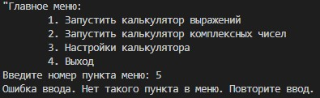
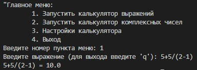
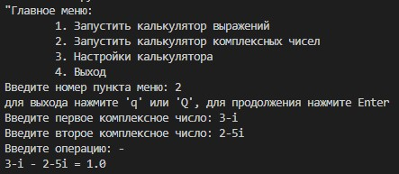
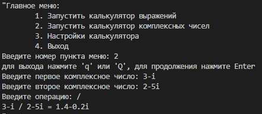
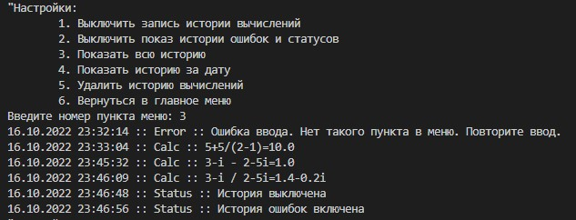
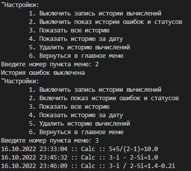
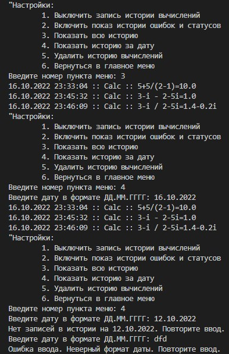

# Приложение консольное: Калькулятор.

## Модули:

1. main.py - основной модуль. Обрабатывает работу пользователя в меню "menu.py" и запускает работу соответствующих функций других модулей.
2. menu.py - модуль меню. Выполняет функцию общения с пользователем. Передаёт в main.py значения для запуска соответствующих функций других модулей.
3. logger.py - содержит функции для работы с log-файлом ""log.txt". Такими как форматная запись истории вычислений  и смены статуса настроек вывода данных с log-файла в консоль, считывание log-файла с созданием списка словарей каждой для каждой записи, очистка истории.
4. errhandling.py - модуль обработки ошибок ввода пользователя и функции проверки разного рода ошибок. Обработка ошибок математических вычислений содержится непосредственно в модулях вычисления.
5. config.py - модуль хранения параметров конфигурации настроек калькулятора, а также функций переключения этих параметров.
6. calculator.py - модуль калькуляции выражений в виде строки с использованием вещественных чисел, операций сложения, разности, умножения, деления и скобок.
7. complex_calculator.py - модуль проведения математических операций сложения, разности, умножения и деления над двумя комплексными числами вида a+bi. От пользователя требуется поочерёдное введение двух комплексных чисел и отдельного указания операции над ними.

## Скрины работы калькулятора

 * Обработка неверного пункта меню  

* Работа модуля калькулятора вещественных вырожений
  

* Работа модуля калькулятора для двух комплексных чисел

* Вывод лога в консоль с указанием даты, типа и описания действия.
  

* Измение настроек вывода на экран данных log-файла.

* Вывод данных log-файла на указанную пользователем дату и обработка ошибок.
  
