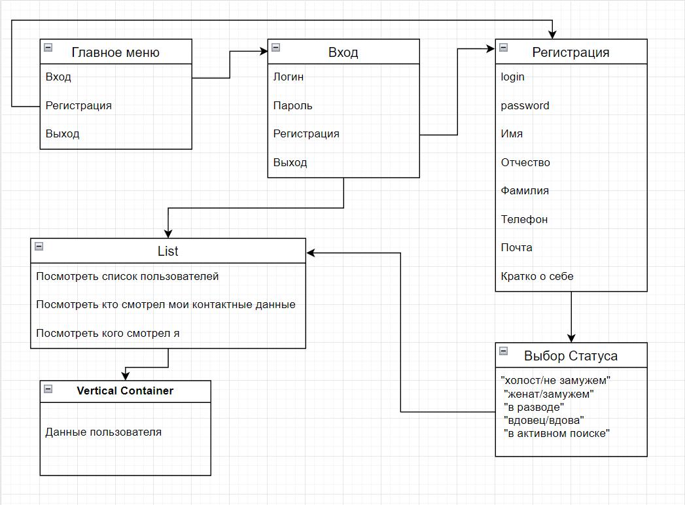
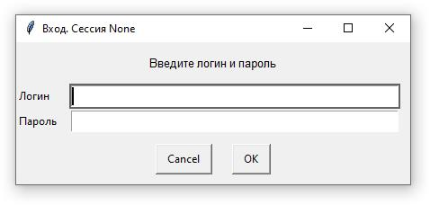
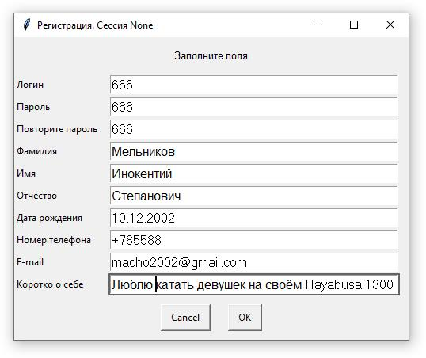
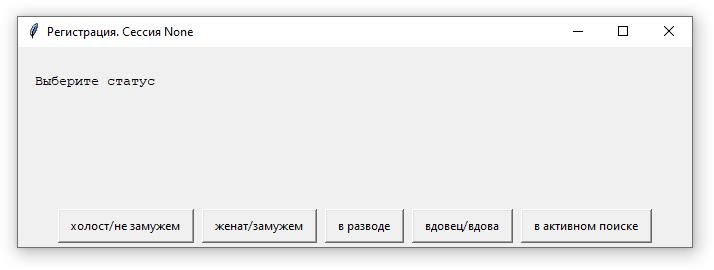
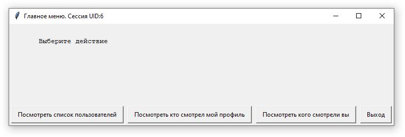
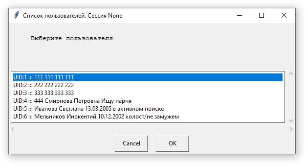
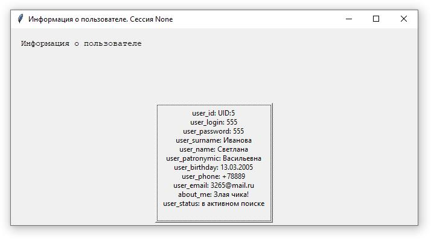
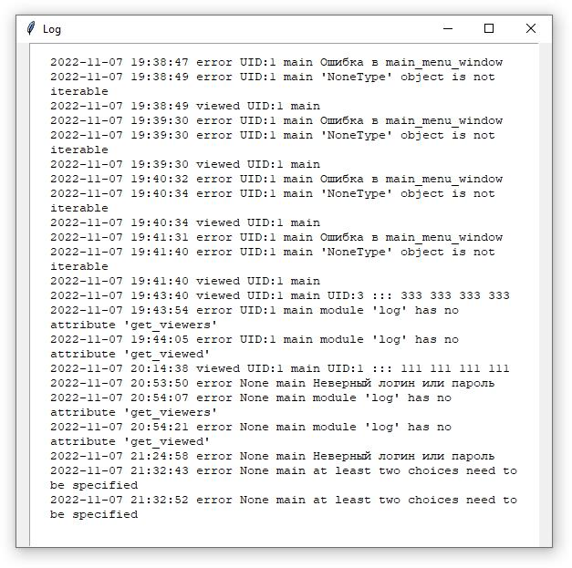

# Приложение c оконным интерфейсом. Взаимный список контактов

## Модули:

1. main.py - основной модуль. Обрабатывает работу пользователя в меню "UI.py" и запускает работу соответствующих функций других модулей.
2. UI.py - модуль меню. Выполняет функцию общения с пользователем. Передаёт в main.py значения для запуска соответствующих функций других модулей.
3. log.py - содержит функции для работы с log-файлом "log.JSON". Запись идёт в следующем формате:
   
    { "date": "2019-11-11 11:11:11", "type": "type1", "user": "user1", "module": "module1", "param": "param1" }

4. errщк_handlук.py - модуль обработки ошибок ввода пользователя и функции проверки разного рода ошибок. 
5. config.py - модуль хранения параметров программы.
6. json_request.py - модуль обработки запросов к базе данных пользователей.

## Cхема меню

## Скриншоты меню

### Стартовое меню

### Меню входа

### Меню регистрации

### Выбор статуса при регистрации

### Главное меню

### Список пользователей

### Данные пользователя

### Экран логирования ошибок

